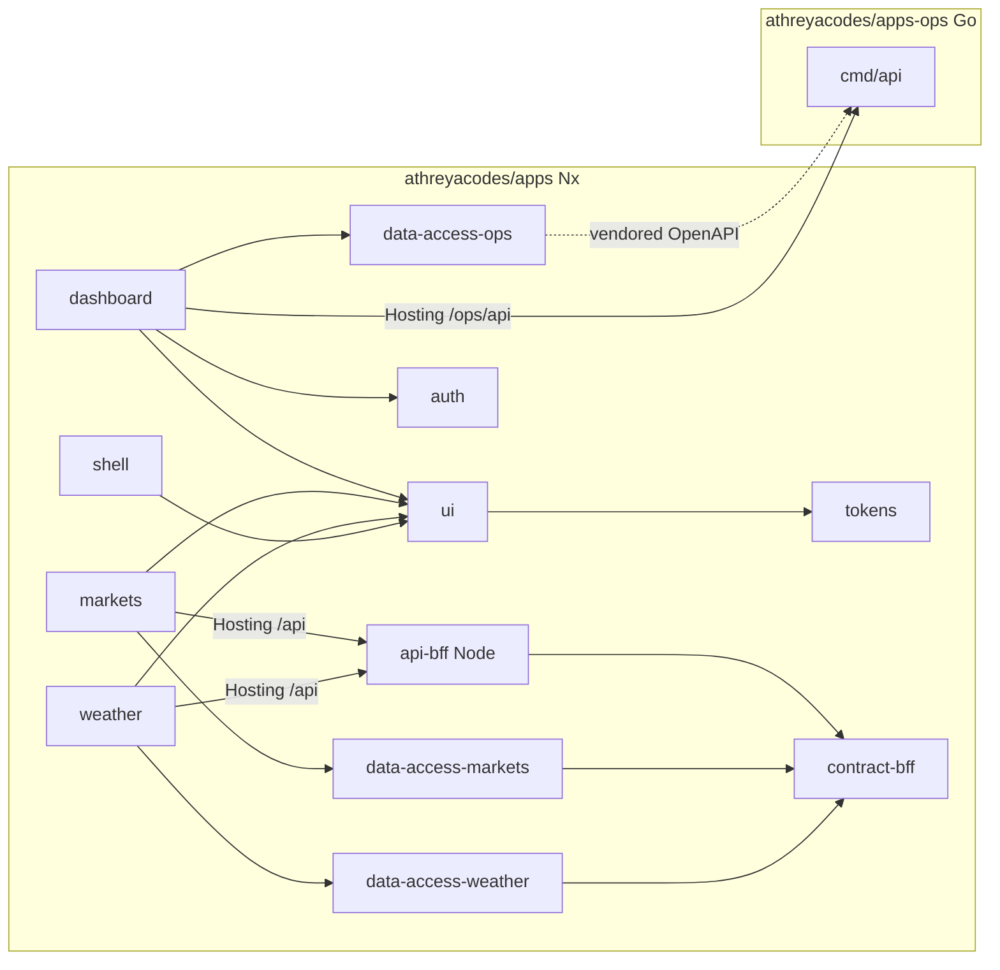

# Apps — architecture and delivery plan

Living architecture for **Apps** (`apps.athreya.codes`). This is the document to maintain. The original brief is [genesis-prompt.md](./genesis-prompt.md).

Status: **Phase 0 complete** (Nx skeleton). Phase 1 (weather + BFF live) has not started.

Product name is Apps. GitHub repo today is `athreyacodes/platform`; rename to `athreyacodes/apps` before Phase 1 public traffic. Firebase project is the existing `apps-athreya-codes`.

---

## 1. Decisions

| Question         | Choice                                                                                                                | Why                                                                                                                                                                                            | We skipped                                                                                               |
| ---------------- | --------------------------------------------------------------------------------------------------------------------- | ---------------------------------------------------------------------------------------------------------------------------------------------------------------------------------------------- | -------------------------------------------------------------------------------------------------------- |
| Repo split       | **B** — Nx = Angular + Node BFF; Go in sibling `athreyacodes/apps-ops`                                                | Weather/markets UI and BFF share TypeScript contracts and should ship in one PR. `@nx/node` is first-class; affected is honest. Go does not get a real Nx graph unless we maintain it by hand. | **A** (Go-in-Nx costume). **C** (BFF in another repo splits cache TTL + weather card into two PRs).      |
| GitHub repo      | Same repo, **rename `platform` → `apps`**                                                                             | Product is Apps. Hiring manager clones `athreyacodes/apps`. GitHub redirects the old URL.                                                                                                      | A second empty repo. Keeping the `platform` name after the rebrand.                                      |
| Starter code     | **Replace** the Angular 21 CLI app in Phase 0. No `nx init` on top of it.                                             | Current `src/` is a greeting that redirects to `profile.athreyamr.dev`. Converting it leaves a root app beside `apps/`.                                                                        | Migrating greeting/home/main-navigations into `apps/shell`. Dual CLI + Nx trees.                         |
| Firebase / GCP   | Existing project **`apps-athreya-codes`** (hosting site of the same id). This is also the Cloud Run project.          | Project already exists. How and portfolio stay in their own projects.                                                                                                                          | New Firebase project. Extra GCP project. Reusing throwaway `platform-4149d`.                             |
| Shell vs apps    | **Independent Nx apps on paths**, shared chrome via `ui` + `tokens`. Full page loads between products.                | You chose `apps.athreya.codes/weather` and `/dashboard`. Same origin makes Hosting → Cloud Run rewrites and ops cookies simple. Products still `nx serve` alone.                               | Subdomains. Module Federation on day one. One SPA of lazy feature libs (products would not serve alone). |
| Node             | **One Fastify process** on Cloud Run (`apps-bff`) for weather + markets                                               | One public BFF, stable DTOs, cache, rate limit. Same shape as Go.                                                                                                                              | Cloud Functions. Split Node services. Provider keys in the browser.                                      |
| Go               | Small **stdlib `net/http` + chi** on Cloud Run (`apps-ops`). GitHub OAuth + allowlist in Go. OpenAPI is the contract. | Ops is GitHub + domain checks, not a second Node service. Honest binary, flags, exit codes.                                                                                                    | Firebase Functions. Firebase Auth for ops. Wrapping Go in an Nx plugin / `run-commands`.                 |
| Weather upstream | **Open-Meteo** forecast + geocoding, no vendor key                                                                    | No key in the browser or in Secret Manager. CC BY attribution in the UI. BFF still owns cache and DTOs.                                                                                        | Vendor weather APIs that need keys. Calling Open-Meteo from Angular.                                     |
| Markets upstream | **Frankfurter v2** (`api.frankfurter.dev`), FX, no key                                                                | TOS-friendly for a public site. Central-bank rates. ECB-class data caches for hours.                                                                                                           | Finnhub (personal-use / redistribution). Yahoo or terminal scraping. Equity quotes in v1.                |
| Frontends        | Firebase Hosting, **one site**, path compose. CSR for weather / markets / dashboard. **Prerender shell home only.**   | Live data pages should not SSG stale payloads. Authenticated dashboard must not prerender.                                                                                                     | Per-app Hosting sites. Prerendering ops. SSG of forecast/rates pages.                                    |
| Remote cache     | **Nx Cloud from Phase 0 CI**                                                                                          | Explicit override of genesis “not in phase 0”. Public repo; traces are public.                                                                                                                 | Delaying Cloud to Phase 4. Actions cache of `.nx/cache` as the primary. Nx Cloud enterprise theatre.     |
| Tests            | **Vitest** for Angular + Node. `go test` in the Go repo. Playwright e2e only for shell routing + BFF `Cache-Control`. | This repo already uses Vitest. Angular 22 unit-test builder. One JS runner.                                                                                                                    | Jest. A full e2e suite. Live weather/markets calls in CI.                                                |
| Formatter / lint | **Prettier** + ESLint with `@nx/enforce-module-boundaries` required in CI                                             | If lint is skipped, we do not have tags. Prettier is already in this repo.                                                                                                                     | Format-optional CI. A second formatter.                                                                  |
| Tooling          | Angular **22**, Nx **≥ 23.1**, TypeScript **6**, npm, Node **22** from `.nvmrc`                                       | Matches How/portfolio. Nx 23.1 is the floor for Angular 22. Other public repos use npm.                                                                                                        | Angular 21 (current starter). pnpm/yarn. Zone.js. A migration sequence.                                  |
| Secrets          | **GitHub OIDC → GCP Workload Identity Federation** for this project                                                   | New project should not copy How/portfolio’s service-account JSON. Laptop deploy is not the documented path.                                                                                    | Migrating How/portfolio off SA JSON. Documenting `firebase deploy` from a laptop as the path.            |
| Backend previews | **Skip until needed.** Preview channels call live Cloud Run (public APIs are read-only; dashboard is allowlisted).    | Do not pile backend preview revisions into Phase 0–1.                                                                                                                                          | Tagged Cloud Run revisions before Phase 4. A fake umbrella pipeline across two repos.                    |

---

## 2. The Node/Go repo challenge

Do not default to “everything in one Nx workspace because it is a platform.”

| Option                                                     | Affected / CI / deploy                                                                                                                                                                                                      | What a hiring manager clones                                                              | What we skip                                                                      |
| ---------------------------------------------------------- | --------------------------------------------------------------------------------------------------------------------------------------------------------------------------------------------------------------------------- | ----------------------------------------------------------------------------------------- | --------------------------------------------------------------------------------- |
| **A.** One polyglot Nx repo (Angular + Node + Go)          | Must hand-maintain Go `project.json`. `run-commands` wrapping `go test` is costume unless tags and implicitDeps are real. Easy to `setup-go` on a CSS-only PR. One workflow pretends to be three.                           | One repo that claims a graph it does not really have. Three READMEs with no honest edges. | Honest Go CI. A small Dockerfile + `go test ./...` story.                         |
| **B.** Nx = Angular + Node. Go sibling. **PICK**           | `nx affected -t lint,test,build` vs `origin/main` is real for TypeScript imports. `@nx/node` is first-class. OpenAPI/Zod live next to clients. Go repo: `setup-go`, `go test ./...`, Cloud Run. Two workflows, no umbrella. | `apps` for the platform graph. `apps-ops` for a boring excellent Go service.              | Nx-wrapping Go. `npm ci` on a Go-only PR. `setup-go` on a tokens-only Angular PR. |
| **C.** Nx = Angular only. Sibling api repo holds Node + Go | Weather card + cache TTL cannot ship in one PR. Angular consumes public HTTP only. Contract drift is the daily cost.                                                                                                        | Two TypeScript repos plus Go.                                                             | The reason Node belongs next to Angular.                                          |

**Pick: B.** Lean is not wrong here.

- Ops UI is an HTTP client. Go cadence can lag a day behind a dashboard copy tweak. That is fine if OpenAPI is versioned.
- Node is wrong to split. BFF DTOs and Angular `data-access-*` should share Zod in this repo.

Keep Go in Nx only if ops UI and ops API ship as one cadence forever **and** we actually model Go projects, tags, and implicitDependencies — not a fake `project.json`. We will not do that.

Put Node in a sibling api repo only if the BFF is several services with its own release train. We have one process. That cost is “one PR for cache TTL + weather card.”

Hard rules whichever way:

- Browser never holds provider API keys. Weather and markets go through Node.
- Go owns ops: GitHub pushes/Actions, domain/subdomain checks. Not a second Node service because we already have Node.
- Contracts between repos are versioned: OpenAPI for Go. Angular data-access does not scrape HTML.
- Each repo’s CI only does work that repo can affect.
- Do not use a monorepo to hide three READMEs with no graph.

---

## 3. Repo and project graph



### 3.1 GitHub

| Repo                                         | Role                                         |
| -------------------------------------------- | -------------------------------------------- |
| `athreyacodes/apps` (rename from `platform`) | Nx workspace: Angular apps + Node BFF        |
| `athreyacodes/apps-ops` (new)                | Go module `github.com/athreyacodes/apps-ops` |
| `athreyacodes/portfolio`                     | Stays. Not merged.                           |
| `athreyacodes/how`                           | Stays. Not merged.                           |
| `athreyacodes/layers-ui`                     | Stays. Consumed as npm from `libs/tokens`.   |

Dashboard watches: `apps`, `how`, `portfolio`, `layers-ui`, `apps-ops`.

### 3.2 Nx tree

Phase 0 **deletes** root `src/`, root `angular.json` as the single `"platform"` project, and the `platform-4149d` Hosting workflows. Git history stays. The working tree is greenfield Nx, not CLI + Nx stacked.

```
apps/                          # GitHub: athreyacodes/apps
  apps/shell/                  # type:app, scope:shell
  apps/weather/                # type:app, scope:weather
  apps/markets/                # type:app, scope:markets
  apps/dashboard/              # type:app, scope:dashboard
  apps/api-bff/                # type:api, scope:bff
  libs/tokens/                 # type:ui, scope:platform   layers-ui + Apps tokens
  libs/ui/                     # type:ui, scope:platform   page-frame, chip, empty/error
  libs/auth/                   # type:auth, scope:dashboard
  libs/contract-bff/           # type:util, scope:bff       Zod DTOs
  libs/data-access-weather/    # type:data-access, scope:weather
  libs/data-access-markets/    # type:data-access, scope:markets
  libs/data-access-ops/        # type:data-access, scope:dashboard  + vendored openapi.yaml
  firebase.json
  nx.json
  .nvmrc                       # 22 (match How: 22.22.3 line)
  docs/plan.md
  docs/genesis-prompt.md
```

### 3.3 Go tree

```
apps-ops/
  cmd/api/main.go
  internal/githubx/            # Actions + commits for allowlisted public repos
  internal/domains/            # HTTPS checks for sites we actually run
  internal/auth/               # GitHub OAuth, session cookie, allowlist
  api/openapi.yaml             # source of truth
  Dockerfile
```

Optional later (not v1): `cmd/check` CLI wrapping the same domain/GitHub checks, flags, exit codes. Do not wrap that CLI in an Nx plugin.

### 3.4 Tags and allowed dependencies

Enforced in CI with `@nx/enforce-module-boundaries`. If lint is skipped, we do not have tags.

| Tag                | May depend on                                                 | Must not                                               |
| ------------------ | ------------------------------------------------------------- | ------------------------------------------------------ |
| `type:app`         | `type:ui`, `type:data-access`, `type:auth`, `type:util`       | other `type:app`                                       |
| `type:ui`          | `type:ui`, `type:util`                                        | `type:data-access`, `type:api`, apps                   |
| `type:data-access` | `type:util`                                                   | apps, `type:ui` (except tokens via app styles, not TS) |
| `type:auth`        | `type:data-access`, `type:util`                               | apps                                                   |
| `type:api`         | `type:util`                                                   | Angular apps, `type:ui`                                |
| `scope:weather`    | `scope:platform`, `scope:bff` (contract only via data-access) | `scope:markets`, `scope:dashboard`                     |
| `scope:markets`    | `scope:platform`, `scope:bff`                                 | `scope:weather`, `scope:dashboard`                     |
| `scope:dashboard`  | `scope:platform`                                              | `scope:weather`, `scope:markets`, `scope:bff`          |
| `scope:shell`      | `scope:platform`                                              | product data-access libs                               |
| `scope:bff`        | `scope:bff` (`contract-bff`)                                  | Angular apps                                           |

No `libs/shared` junk drawer. Named libs by job: `ui`, `auth`, `data-access-*`, `tokens`, `contract-bff`.

### 3.5 implicitDependencies

| Edge                                                                | Why                                                                                                         |
| ------------------------------------------------------------------- | ----------------------------------------------------------------------------------------------------------- |
| Every Angular app → `tokens`                                        | CSS is not an import graph. A token change must affect all frontends.                                       |
| Frontend deploy targets → `firebase.json` + hosting assemble script | Hosting rewrite/header edits must rebuild/redeploy the site.                                                |
| `data-access-ops` → vendored `openapi.yaml`                         | Spec edits must fail/rebuild the client. Add a checksum or contract test vs the documented Go spec version. |

`contract-bff` is a real TypeScript import. No implicitDep needed.

`layers-ui` is an npm dependency of `tokens`, not a local project. Bumping it in the lockfile already dirties every app that lists tokens as implicit. Apps must not import `layers-ui` directly — only via `libs/tokens`.

### 3.6 Env owners

| Project      | Env                                                                                                                | Notes                                                                                                                                                 |
| ------------ | ------------------------------------------------------------------------------------------------------------------ | ----------------------------------------------------------------------------------------------------------------------------------------------------- |
| Angular apps | `apiBaseUrl`                                                                                                       | Empty string in production (same origin). `http://localhost:3000` when serving the BFF locally. Dashboard uses `/ops/api` on the same origin in prod. |
| `api-bff`    | `UPSTREAM_TIMEOUT_MS` (optional), `PORT`                                                                           | No vendor keys in v1.                                                                                                                                 |
| `apps-ops`   | `GITHUB_OAUTH_CLIENT_ID`, `GITHUB_OAUTH_CLIENT_SECRET`, `SESSION_SECRET`, `ALLOWLIST_GITHUB_USERS`, `GITHUB_TOKEN` | Fine-grained PAT: Actions read + metadata on the public watch list. GitHub App is a later upgrade.                                                    |

---

## 4. Products and APIs

Public UI is one site: `https://apps.athreya.codes`. Local serve-alone: `nx serve weather` (own port). Shared `ui` page-frame so chrome matches without federation.

| App           | URL          | Data                                                                                                                                                                                  | Auth                                      | Empty                       | Error                                                                                             | Will not build                                                                |
| ------------- | ------------ | ------------------------------------------------------------------------------------------------------------------------------------------------------------------------------------- | ----------------------------------------- | --------------------------- | ------------------------------------------------------------------------------------------------- | ----------------------------------------------------------------------------- |
| **shell**     | `/`          | Static copy: what Apps is, links to products, outbound to athreya.codes and how.athreya.codes, short architecture note (repo split, affected CI).                                     | None                                      | n/a                         | Generic route fallback                                                                            | CMS, blog, resume, greeting redirect, clone of athreya.codes, federation host |
| **weather**   | `/weather`   | Open-Meteo via BFF: city search, current, 7-day forecast. Last city in `localStorage`.                                                                                                | None                                      | Prompt to search            | Upstream/BFF failure with retry. Attribution: Open-Meteo CC BY                                    | Maps, alerts, radar, accounts, calling Open-Meteo from the browser            |
| **markets**   | `/markets`   | Frankfurter via BFF: pair picker, latest rate, short history sparkline, convert-an-amount. Watchlist in `localStorage`.                                                               | None                                      | Add a pair                  | Upstream/BFF; show stale if cache allows. Attribution: Frankfurter + provider (ECB filter in BFF) | Stocks, orders, scraping, login-synced watchlists, paid terminals             |
| **dashboard** | `/dashboard` | Go API: recent pushes + Actions for `apps`, `how`, `portfolio`, `layers-ui`, `apps-ops`. HTTPS status for `athreya.codes`, `how.athreya.codes`, `apps.athreya.codes`, layers-ui docs. | GitHub OAuth via Go; allowlisted identity | No runs / unchecked domains | 401 → login. 503 → probe failure. Never leak tokens in UI or logs                                 | Workflow dispatch, secret scanning UI, job-log streaming, Firebase Auth       |

---

## 5. Backend contracts

Audience DTOs live in `libs/contract-bff` (Zod) for Node. Go uses OpenAPI. Do not “hide columns” on the client — the BFF returns only what that audience may see.

### 5.1 Node BFF — Cloud Run `apps-bff`

Firebase Hosting rewrite: `/api/**` → Cloud Run `apps-bff`.

| Method | Path                                      | Response (shape)                                                            |
| ------ | ----------------------------------------- | --------------------------------------------------------------------------- |
| GET    | `/api/health`                             | `{ status: "ok" }`                                                          |
| GET    | `/api/weather/search?q=`                  | `{ results: { id, name, country, lat, lon }[] }`                            |
| GET    | `/api/weather/forecast?lat=&lon=`         | `{ location, current, daily[] }` — **our** DTO, not Open-Meteo’s wire shape |
| GET    | `/api/markets/currencies`                 | `{ currencies: { code, name }[] }`                                          |
| GET    | `/api/markets/rate?base=&quote=`          | `{ base, quote, rate, asOf, provider }`                                     |
| GET    | `/api/markets/history?base=&quote=&from=` | `{ points: { date, rate }[] }`                                              |
| GET    | `/api/markets/rates?base=&quotes=`        | Watchlist batch — do not N+1 from the client                                |

**Cache (in-process TTL)**

| Resource                               | TTL  | Notes                     |
| -------------------------------------- | ---- | ------------------------- |
| Weather search                         | 1 h  | Geocoding is stable       |
| Weather forecast                       | 15 m | Short enough to feel live |
| FX currencies / rate / history / batch | 1 h  | ECB-class daily data      |

Honest limitation: Cloud Run scale-to-zero empties memory. Set `Cache-Control` / `s-maxage` on GET so Hosting/CDN can help. No Redis in v1.

**Rate limit:** per-IP on `/api`, about 60/min.

**Secrets:** none required for v1 upstreams. Browser never holds Open-Meteo or Frankfurter keys (there are none). The contract the UI depends on is our DTO, not the upstream JSON.

**CI:** mock upstreams. No live weather/markets calls.

### 5.2 Go ops — Cloud Run `apps-ops`

Firebase Hosting rewrite: `/ops/api/**` → Cloud Run `apps-ops`.

| Method | Path                     | Response                                                                           |
| ------ | ------------------------ | ---------------------------------------------------------------------------------- |
| GET    | `/ops/api/health`        | `{ status: "ok" }`                                                                 |
| GET    | `/ops/api/me`            | Session identity or 401                                                            |
| GET    | `/ops/api/auth/login`    | GitHub OAuth redirect                                                              |
| GET    | `/ops/api/auth/callback` | Set httpOnly Secure cookie; redirect `/dashboard`                                  |
| POST   | `/ops/api/auth/logout`   | Clear cookie                                                                       |
| GET    | `/ops/api/repos`         | Allowlisted public repos, latest push, latest workflow runs. **No job logs in v1** |
| GET    | `/ops/api/domains`       | `{ host, status, statusCode, tlsExpiry, checkedAt }[]`                             |

Auth: GitHub OAuth, httpOnly Secure cookie, `ALLOWLIST_GITHUB_USERS`. Public weather/markets stay unauthenticated.

**Contract versioning:** `apps-ops/api/openapi.yaml` is source. Copy into `libs/data-access-ops/openapi.yaml` in an Apps PR when the Go API breaks. **Go first** only when the dashboard would 500 without the change. Otherwise the UI can lag.

---

## 6. CI/CD per repo

Same builders on PR and `main`. Never `run-many --all` on main and `affected` on PRs.

### 6.1 `athreyacodes/apps`

| File                            | When                              | Jobs              | What it does                                                                                                                                                                                                                                                  |
| ------------------------------- | --------------------------------- | ----------------- | ------------------------------------------------------------------------------------------------------------------------------------------------------------------------------------------------------------------------------------------------------------- |
| `.github/workflows/ci.yml`      | `pull_request` + `push` to `main` | `affected`        | `checkout` with `fetch-depth: 0`. `setup-node` from `.nvmrc` + npm cache. `npm ci`. Nx Cloud start. `npx nx affected -t lint,test,build --base=origin/main --head=HEAD`. Format check is a `lint` or `format` target in affected. Module boundaries must run. |
| `.github/workflows/preview.yml` | `pull_request` (same-repo only)   | `hosting-preview` | Phase 1: build the frontends that exist, compose Hosting folder, `firebase hosting:channel:deploy`. Phase 4: restore last-good artifacts for unaffected apps. Fork PRs skipped (same guard as How/portfolio).                                                 |
| `.github/workflows/deploy.yml`  | `push` to `main`                  | `hosting`, `bff`  | `hosting`: compose + live channel. `bff`: if `api-bff` affected, Docker → Artifact Registry → Cloud Run `--revision-suffix=$GITHUB_SHA`. Permissions: `id-token: write`, `contents: read`. Auth: `google-github-actions/auth` WIF.                            |

Delete the current `firebase-hosting-merge.yml` and `firebase-hosting-pull-request.yml` (they target `platform-4149d` and `npm run build` the starter). Phase 0 adds `ci.yml` only. Preview/deploy land in Phase 1.

**GitHub environment:** `production` for `deploy.yml` (WIF + Firebase). No separate preview environment required if preview uses the same WIF with Hosting preview channels.

**Secrets / vars (Apps repo)**

| Name                                     | Where                                      | Purpose                               |
| ---------------------------------------- | ------------------------------------------ | ------------------------------------- |
| Nx Cloud token / `NX_CLOUD_ACCESS_TOKEN` | Repo secret or Nx Cloud GitHub integration | Remote cache from Phase 0             |
| WIF provider + service account           | GitHub environment `production`            | `google-github-actions/auth`          |
| GCP project `apps-athreya-codes`         | Environment / var                          | Cloud Run, Artifact Registry, Hosting |

How/portfolio keep `FIREBASE_SERVICE_ACCOUNT_*` JSON. Do not copy that pattern here.

### 6.2 `athreyacodes/apps-ops`

| File                           | When        | What                                                                                         |
| ------------------------------ | ----------- | -------------------------------------------------------------------------------------------- |
| `.github/workflows/ci.yml`     | PR + `main` | `go test ./...`, `go vet ./...`, `gofmt -l` must be empty. **No npm. No setup-node.**        |
| `.github/workflows/deploy.yml` | `main`      | Docker + Cloud Run, image tagged with git sha. WIF. Docker layer cache `cache-from/to: gha`. |

**Secrets (Go repo / `production`):** OAuth client, `SESSION_SECRET`, allowlist, `GITHUB_TOKEN` in Secret Manager; GitHub Actions only needs WIF to deploy. App secrets are not Actions secrets if Cloud Run mounts Secret Manager — prefer that.

### 6.3 Cache

- Local: `.nx/cache`
- Remote: **Nx Cloud** from the first affected CI (Phase 0)
- Fallback only: Actions cache of `.nx/cache` if Cloud is misconfigured
- Docker layer cache for `apps-bff` and `apps-ops` images

### 6.4 Deploy mapping

| Nx / Go project                            | Target                                               |
| ------------------------------------------ | ---------------------------------------------------- |
| `shell`, `weather`, `markets`, `dashboard` | One Hosting site `apps-athreya-codes` (path compose) |
| `api-bff`                                  | Cloud Run `apps-bff`                                 |
| Go `cmd/api`                               | Cloud Run `apps-ops`                                 |

Affected frontend deploy: rebuild affected apps, reuse last-good dist for the rest, one `firebase deploy --only hosting:apps-athreya-codes` (or the site target name we configure). Until more than two frontends exist, building every current frontend is acceptable. Phase 1 does that. Phase 4 adds artifact compose so a weather-only change cannot wipe `/markets`.

**Rollback**

- Cloud Run: GCP console → Cloud Run → service → Revisions → manage traffic → previous sha. Or `gcloud run services update-traffic SERVICE --to-revisions=PREV=100`.
- Firebase Hosting: Firebase console → Hosting → site `apps-athreya-codes` → Release history → **Rollback** on the previous release. No custom rollback tool.

**Cross-repo order:** none for weather/markets. For ops: Go first only on breaking OpenAPI; the dashboard PR updates the vendored spec in the same change window.

Laptop deploy is not the documented path.

---

## 7. Hosting and DNS

### 7.1 Inventory

| Item                                   | Value                                                                                                            |
| -------------------------------------- | ---------------------------------------------------------------------------------------------------------------- |
| GitHub (today)                         | `athreyacodes/platform`                                                                                          |
| GitHub (target)                        | `athreyacodes/apps`                                                                                              |
| Go repo                                | `athreyacodes/apps-ops` (create in Phase 3)                                                                      |
| Firebase / GCP project                 | `apps-athreya-codes` (exists; project number `1074049731655`)                                                    |
| Hosting site ID                        | `apps-athreya-codes`                                                                                             |
| Custom domain                          | `apps.athreya.codes`                                                                                             |
| Cloud Run region                       | `us-central1` (Firebase Hosting rewrite default; Asia latency is an accepted tradeoff)                           |
| Cloud Run services                     | `apps-bff`, `apps-ops`                                                                                           |
| Other Firebase projects (do not merge) | `how-athreya-codes`, `portfolio-f2684`                                                                           |
| Throwaway                              | `platform-4149d` workflows and `FIREBASE_SERVICE_ACCOUNT_PLATFORM_4149D`                                         |
| DNS                                    | Same zone as `athreya.codes` / `how.athreya.codes`. Add the domain in Hosting; apply TXT/A/CNAME Firebase shows. |
| Ops watches (repos)                    | `apps`, `how`, `portfolio`, `layers-ui`, `apps-ops`                                                              |
| Ops watches (hosts)                    | `athreya.codes`, `how.athreya.codes`, `apps.athreya.codes`, layers-ui docs (`athreyacodes.github.io/layers-ui`)  |

### 7.2 Path compose

Each Angular app sets `baseHref`:

| Path            | App                                    |
| --------------- | -------------------------------------- |
| `/`             | shell (prerender home)                 |
| `/weather/**`   | weather                                |
| `/markets/**`   | markets                                |
| `/dashboard/**` | dashboard                              |
| `/api/**`       | Hosting rewrite → Cloud Run `apps-bff` |
| `/ops/api/**`   | Hosting rewrite → Cloud Run `apps-ops` |

`firebase.json`: composed public directory, SPA fallback per app folder, Cloud Run rewrites, security headers aligned with How/portfolio (HSTS, `X-Content-Type-Options`, `Referrer-Policy`, `Permissions-Policy`, `X-Frame-Options` / frame-ancestors).

Preview: Hosting preview channels, same pattern as How/portfolio.

Do not put How or portfolio into this Firebase project. Prefer one project with one Hosting site for Apps; isolation is not worth extra projects here.

---

## 8. Performance budget

| Control                       | Policy                                                               |
| ----------------------------- | -------------------------------------------------------------------- |
| Builder                       | Angular application builder (esbuild)                                |
| Source maps                   | CI artifacts, **not** uploaded to Hosting. Dashboard: no public maps |
| Initial JS                    | Warning **150 kB**, error **250 kB** per app                         |
| `anyComponentStyle`           | Warning 4 kB, error 8 kB                                             |
| Shell                         | Prerender home HTML                                                  |
| weather / markets / dashboard | CSR                                                                  |
| Bundle stats                  | Optional artifact on affected frontends in Phase 4                   |
| BFF                           | gzip, short JSON DTOs, batch watchlist endpoint                      |

Parallelism in CI only if it saves real minutes (Nx Cloud + affected already overlap work).

---

## 9. Risks

| Risk                              | Mitigation                                                                                                       |
| --------------------------------- | ---------------------------------------------------------------------------------------------------------------- |
| Graph lies                        | `implicitDependencies` for tokens and `firebase.json`. Prove in Phase 0: tokens-only PR vs weather-only PR.      |
| Path compose wipes a sibling app  | Phase 1 builds every frontend that exists. Phase 4 last-good artifacts. Never deploy a partial `public/` folder. |
| Nx Cloud on a public repo         | Treat traces as public. Do not log secrets.                                                                      |
| Open-Meteo TOS                    | Non-commercial free tier + CC BY attribution. Personal showcase. If it becomes commercial, pay or stop.          |
| Frankfurter                       | No quota; still cache in the BFF. Do not call it from the browser.                                               |
| GitHub rate limits / Actions logs | Server token. No job-log dump in JSON. Redact in Go logs.                                                        |
| Split-repo contract drift         | Vendored OpenAPI + client fails closed on unknown required fields.                                               |
| WIF                               | Phase 1 blocker, not application code.                                                                           |
| Cookie + Hosting rewrite          | Verify session cookie on `apps.athreya.codes` through `/ops/api`. Local: localhost BFF/Go + `withCredentials`.   |
| Rename `platform` → `apps`        | Update remote, Nx Cloud workspace, badges. GitHub redirect covers old clone URLs.                                |
| In-memory cache + scale-to-zero   | Document it. Rely on `Cache-Control`. No Redis until it hurts.                                                   |

---

## 10. Phases

### Phase 0 — Nx skeleton (no production traffic)

Replace the Angular 21 starter. Do not convert it in place.

- Nx ≥ 23.1, Angular 22, zoneless, tags, Vitest, Prettier, ESLint module boundaries.
- Empty apps: `shell`, `weather`, `markets`, `dashboard`. Empty `api-bff`.
- `libs/tokens` + `libs/ui` stubs so implicitDeps and boundaries exist.
- `.github/workflows/ci.yml` + Nx Cloud. **No deploy workflows yet.**
- Delete root `src/`, CLI-only config, `platform-4149d` Hosting workflows.

**Exit:** affected lint/test/build green on a tokens-only PR vs a weather-only PR (the graph is real). **Production:** nothing on `apps.athreya.codes`.

### Phase 1 — Weather + BFF live

- `contract-bff`, `data-access-weather`, Fastify BFF, Cloud Run, Hosting + `apps.athreya.codes`, WIF.
- `preview.yml` + `deploy.yml`. Confirm `platform-4149d` workflows/secrets are gone.

**Exit:** `https://apps.athreya.codes/weather` works. `GET /api/weather/forecast` has cache headers. CI mocks upstream. **Production:** shell + weather + BFF.

### Phase 2 — Markets + tokens

- Frankfurter DTOs, watchlist UI, `layers-ui@^0.26` via `libs/tokens`.

**Exit:** `/markets` + batch rates. A token change rebuilds all frontends via implicitDeps. **Production:** + markets.

### Phase 3 — Go ops + dashboard

- Create `athreyacodes/apps-ops`. OpenAPI, OAuth allowlist, dashboard app, Hosting rewrite `/ops/api/**`.

**Exit:** allowlisted GitHub user sees runs + domain status. Unauthenticated `/dashboard` cannot call GitHub. **Production:** + dashboard + `apps-ops`.

### Phase 4 — Hardening + story

- Budgets enforced. Bundle-stats on affected. Hosting artifact compose. README is the architecture story, including why Go is not in Nx. Optional Cloud Run tagged previews.

**Exit:** README and this file agree. A CSS-only PR does not `setup-go` and does not rebuild `api-bff`.

### Phase 5 — optional

- Module Federation only if we need independent **deploy** of remotes. Path-compose already shares a domain.
- MCP in front of Node/Go APIs we already have — not a v1 product.

---

## 11. Non-goals

- Do not merge `how`, `portfolio`, or `layers-ui` into this repo.
- No React. Angular only on the frontend.
- No UI scraping. No API keys in Angular.
- No CMS.
- No Go-in-Nx `run-commands` costume.
- No `libs/shared`.
- No live weather/markets calls in CI.
- No Module Federation or MCP in v1.
- Do not revive the greeting / `profile.athreyamr.dev` redirect as the Apps home.
- Do not keep the Angular CLI starter beside the Nx tree after Phase 0.
- Do not federate a component library. Share tokens, not a fat widget dump.
- Do not name real employers beyond what the portfolio already states.
